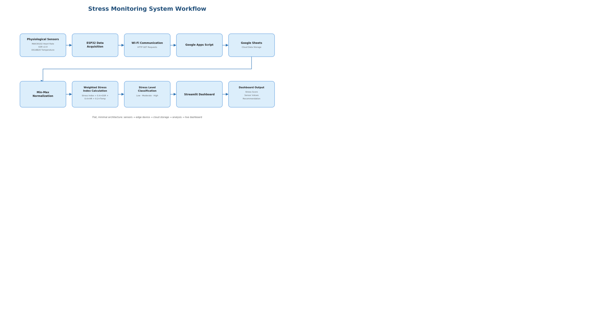
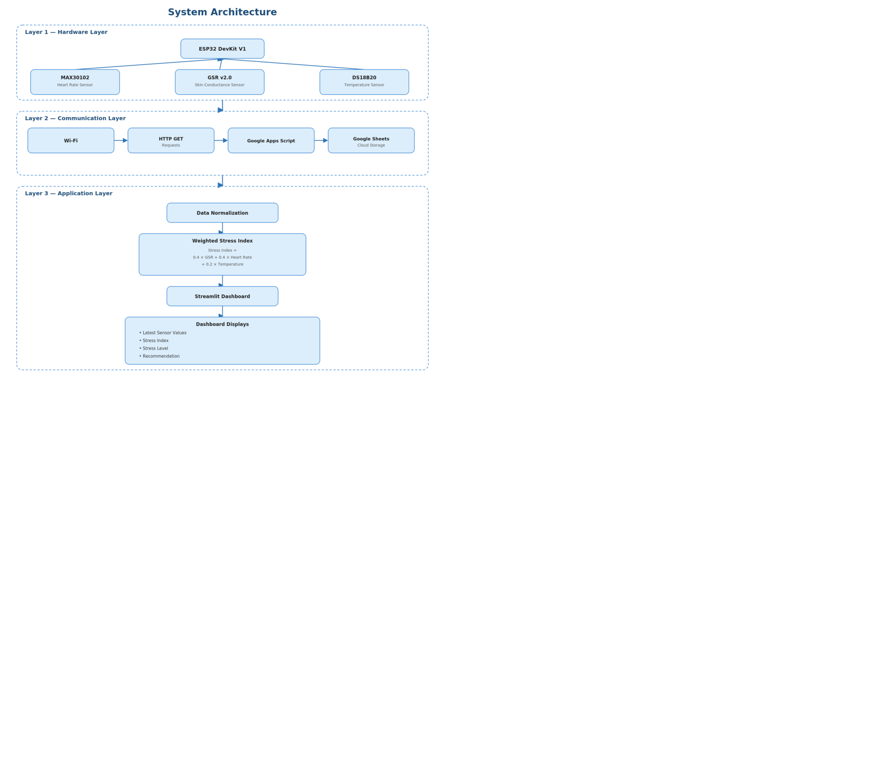
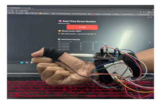

# Stress Monitoring System using ESP32 and IoT

## Overview

This project presents an IoT-based prototype for monitoring physiological signals and estimating stress levels using embedded hardware and cloud-based data processing. The system integrates an ESP32 microcontroller with multiple biomedical sensors to collect skin conductance, heart rate, and body temperature measurements. Sensor data is transmitted wirelessly to Google Sheets through Google Apps Script, where it is processed using a lightweight weighted stress index model and visualized through a Streamlit application.

The project demonstrates the integration of embedded systems, IoT communication, cloud data logging, and physiological signal analysis in a modular and scalable architecture.

---

## Project Overview

| Attribute | Details |
|-----------|---------|
| **Project Type** | IoT-Based Stress Monitoring System |
| **Application** | Physiological Signal Monitoring |
| **Hardware** | ESP32 DevKit V1 |
| **Sensors** | MAX30102, GSR v2.0, DS18B20 |
| **Communication** | Wi-Fi (HTTP GET Requests) |
| **Cloud Storage** | Google Sheets |
| **Dashboard** | Streamlit |
| **Stress Estimation** | Weighted Stress Index |

---

## System Workflow

<p align="center">

</p>

---

## System Architecture

<p align="center">

</p>

---

## Hardware Setup

<p align="center">

</p>

---

## Key Features

- ESP32-based physiological data acquisition
- Integration of GSR, Heart Rate, and Temperature sensors
- Wireless transmission using HTTP requests
- Google Apps Script and Google Sheets integration
- Near real-time cloud data logging
- Weighted Stress Index computation
- Streamlit-based visualization dashboard
- Modular hardware and software architecture

---

## Repository Structure

```text
Stress-Monitoring-System/
│
├── images/
│   ├── architecture.png
│   ├── workflow.png
│   └── hardware_setup.jpg
│
├── esp32/
│   └── stress_monitor.ino
│
├── dashboard/
│   └── app.py
│
├── requirements.txt
├── LICENSE
└── README.md
```

---

## Hardware Components

- ESP32 DevKit V1
- MAX30102 Heart Rate Sensor
- GSR Sensor v2.0
- DS18B20 Temperature Sensor
- Wi-Fi Network

---

## Software Stack

- Arduino IDE
- Python
- Streamlit
- Google Apps Script
- Google Sheets
- NumPy
- Pandas
- Requests

---

## Methodology

### Physiological Signal Acquisition

The ESP32 acquires physiological measurements from the connected biomedical sensors.

Collected parameters include:

- Heart Rate
- Skin Conductance (GSR)
- Body Temperature

---

### Cloud Data Logging

The ESP32 transmits sensor readings to a Google Apps Script endpoint using HTTP requests. The received data is automatically stored in Google Sheets, enabling centralized data collection and remote access.

---

### Stress Index Computation

The collected physiological signals are normalized and combined using a weighted stress index model.

The Stress Index is computed as:

```
Stress Index = 0.4 × GSR + 0.4 × Heart Rate + 0.2 × Temperature
```

The resulting score is categorized into three levels:

- Low Stress
- Moderate Stress
- High Stress

---

## Results

The developed prototype successfully demonstrates:

- Physiological signal acquisition using embedded sensors
- Wireless cloud-based data transmission
- Automated logging to Google Sheets
- Stress index estimation using weighted sensor fusion
- Near real-time monitoring through a Streamlit application

---

## Technologies Used

- C++
- Python
- ESP32
- Arduino IDE
- Streamlit
- Google Apps Script
- Google Sheets
- NumPy
- Pandas
- HTTP Communication

---

## Installation

Clone the repository

```bash
git clone https://github.com/yourusername/Stress-Monitoring-System.git
```

Install the required Python packages

```bash
pip install -r requirements.txt
```

Open the ESP32 firmware located in

```text
esp32/stress_monitor.ino
```

Update:

- Wi-Fi credentials
- Google Apps Script URL

Upload the firmware to the ESP32.

Launch the Streamlit dashboard

```bash
streamlit run dashboard/app.py
```

---

## Limitations

- Developed as a prototype for educational and research purposes.
- Stress estimation is based on a lightweight weighted scoring approach rather than machine learning.
- The system is intended for wellness monitoring and is not designed for clinical diagnosis.

---

## Future Enhancements

- Integration of additional physiological sensors
- Mobile application support
- MQTT-based communication
- Cloud database integration
- Wearable device implementation
- Long-term stress trend analysis

---

## Authors

**Vibha I S**

B.E. Electronics and Communication Engineering

---

## License

This project is licensed under the MIT License.
